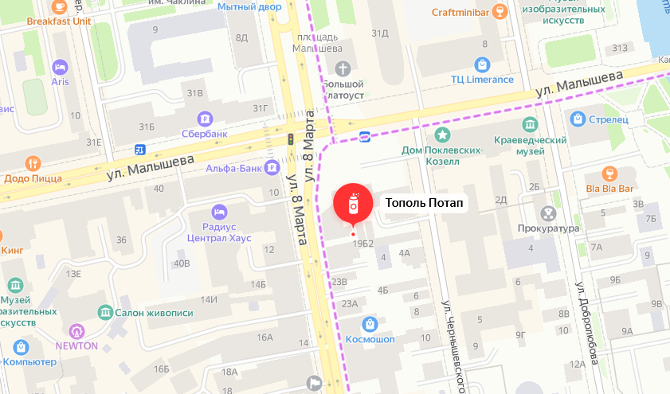
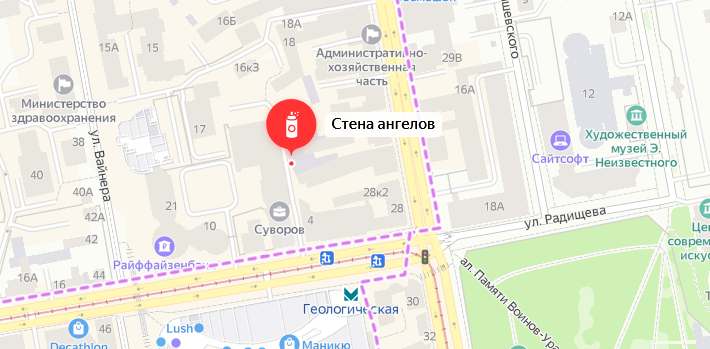
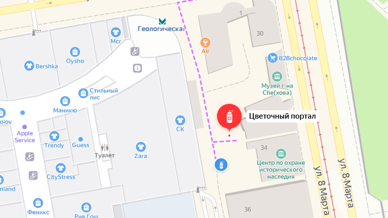
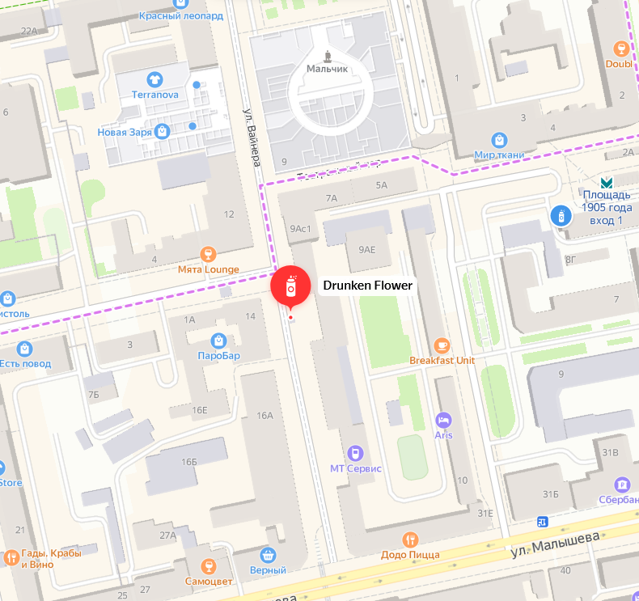
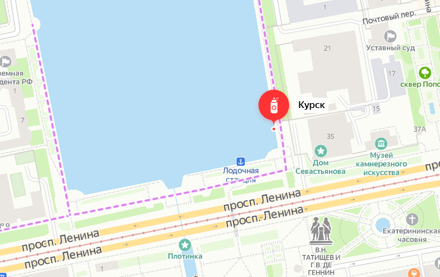
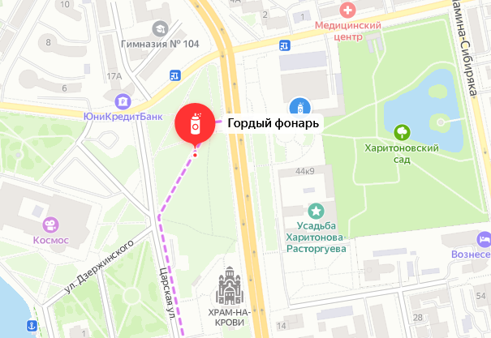
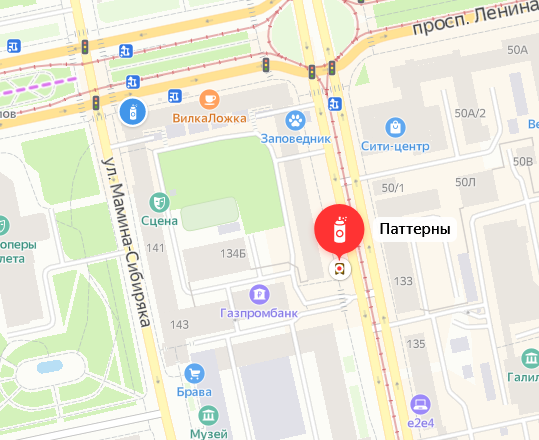

# STENOGRAFFIA

### Тополь Потап | ул. Малышева, 44

Художник из Владивостока, лидер мастерской монументального искусства «33+1», Павел Шугуров создал на первом фестивале уличного искусства STENOGRAFFIA бетонные рельефы высотой в человеческий рост. В течение двух дней Павел наносил изображения на бетонные плиты. Техника создания работы представляет собой последовательное нанесение двух слоев штукатурки, на основе серого и белого цемента, и прорезание в них рельефного изображения. В качестве образов художником были выбраны Бабка Синюшка из сказов Бажова, «Дети перестройки», «Советский инженер» и др. Можно утверждать, что данная авторская техника, при всей ее простоте, долговечна и вандалоустойчива. Как минимум две работы Павла, «Тополь Потап» и «Старик Б.У. Кашкин» дожили до наших дней. Художник ставил своей целью вовлечение публики в некую игру, в поиск объектов и подспудное созидание мифологии микрорайона и города.

### Стена ангелов | ул. 8 Марта, 22/1

На стену старого полузаброшенного здания художники из команды Rainessence нанесли рельеф Донателло «Танцующие ангелочки», который кажется объёмным с любого ракурса. Работы Маши и Славы помогают жителям прочувствовать особую атмосферу города и обратить внимание на эстетику фактурных стен, которые идеально подходят для создания произведений высокого искусства. Так художники «оживляют» заброшенные пространства, а все побитости, неровности и сколы становятся частью арт-объекта.

### Цветочный портал | ул. 8 Марта, 32А

Этот цветочный портал создала художница Лера Разводова вместе со своим мужем, Антоном Кузькиным. В меру трогательная история о проекте, который родился в любви и несет ее в городское пространство. Но все мы знаем, что иногда улица бывает жестока, особенно к таким хрупким историям. Портал на время закрывался, когда каким-то хулиганам мешала неоновая лента. Команда фестиваля уличного искусства STENOGRAFFIA в 2019 году в первый раз восстановилаа переход в другое измерение. Успевайте посмотреть на эту работу в действии, берегите труд художников и себя.

### Брайль-арт | ул. 8 Марта, 46

Вместе с НКО «Белая трость» и креативной командой агентства «Possible Moscow», придумавших проект, STENOGRAFFIA TEAM решила с помощью уличного искусств вдохновить людей, не имеющих возможности видеть. Галерея Брайль-арта состоит из трех объектов: визуальные символы и текст, написанный шрифтом Брайля. Каждый из объектов галереи рассказывает истории известных незрячих людей, сумевших добиться существенных успехов в жизни, несмотря на свой недуг. Томский программист Михаил Пожидаев. Музыкант Рэй Чарльз. Спортсменка Марла Раньян. Все они смогли преодалеть трудности и сделать невероятное.

[рядом с Цветочным порталом]

### Молодой Юрий Гагарин | ул. Малышева, 21/4

В 2014 году Андрей Пальваль, художник из Харькова, в рамках фестиваля уличного искусства STENOGRAFFIA нарисовал портрет Юрия Гагарина по знаменитой фотографии. В арт-объекте заключен призыв к миру и гармонии между странами. В 1961 году с миссией мира и дружбы Ю.А. Гагарин посетил многие государства. Космонавт говорил: «Облетев Землю в корабле-спутнике, я увидел, как прекрасна наша планета. Люди, будем хранить и приумножать эту красоту, а не разрушать её». Художник через свое произведение до сих пор доносит важные мысли до жителей Екатеринбурга: «Образ Юрия Алексеевича одинаково близок и украинцам, и россиянам, и другим жителям бывшего СССР. Он связывает наши народы и напоминает, сколько между нами общего».

### We are not alone | ул. Хохрякова, 16

Лондонский художник Fanakapan стал самым загадочным и космическим участником фестиваля STENOGRAFFIA. Автор гиперреалистичной работы вдохновлялся советскими агитационными елочными игрушками, после чего уже на месте работал с эффектами отражения света и прозрачностью предметов. Fanakapan нарисовал космонавта и добавил к нему в компанию инопланетянина.

### Нейронный стрит-арт | ул. Попова, 9

Роботы создали первый в мире объект уличного искусства. За основу эскиза для работы был взят сюжет об Ахиллесе с мозаичного пола римской виллы Ла Ольмеды, построенной в Испании в середине IV века н.э., в эпоху династии Флавиев. Специально обученная нейросеть Яндекса с помощью машинных алгоритмов восстановила отсутствующие элементы античной мозаики. Рисунок, получившийся у нейросети, был перенесен на торец здания на ул. Попова, 9 с помощью настенного робота-принтера, технология и программное обеспечение которого было разработано творческой командой STENOGRAFFIFA. Анна Клец, координатор фестиваля: «Художник, который в 4 веке нашей эры создавал эту мозаику, не мог даже помыслить, что спустя почти 17 веков его работу восстановит интеллект совершенно другого уровня. Рисунок, созданный роботами – это послание к сегодняшним художникам: представьте, что может произойти в будущем с вами и тем, что вы создаете сегодня? Совершенно непредсказуемо, к какому развитию технологии смогут прийти через пару веков. Каждый из нас может создать то, что спустя время продолжит кто-то из совершенно другого мира».

### Drunken Flower | улица Вайнера

Эта работа — импровизация от лондонского художника Fanakapan. Вдохновением стал воздушный шарик, который он увидел в одном из магазинов Екатеринурга. Арт-объект был создан за 4 часа до вылета в другой город.

### Малахит | ул. 8 Марта, 8В

Художник из Москвы Данила Шмелёв ставит на первое место эффект иллюзии и качество исполнения работы. Пластик в его работах напоминает, что мы живем в пластиковом мире, а дырки — это освобождение от него. В целом работа Данилы представляет собой символ свободы от вещизма и необходимости покупать что-то каждый день, как это диктует реклама. Кроме того арт-объект по цвету получился похож на малахит - камень, ассоциирующийся с Уралом.

### Amor | пер. Химиков, 4

На этой работе испанский художник Zesar изобразил двух обнимающихся женщин. Они символизируют собой дружбу, любовь и понимание. Художник часто поднимает в своих работах темы взаимотношений людей друг с другом и с окружающим миром, используя символичные цветовые сочетания.

### Курск | Городской пруд

Невидимый граффити-памятник трагически известной подлодки К-141 «Курск». 23 августа 2000 года, в России был объявлен днем траура в связи с гибелью подлодки К-141 «Курск». Почти два десятилетия назад экипаж АПЛ спасали всем миром, но все попытки оказались тщетными. После объявления гибели экипажа по всей стране отгремела череда памятных мероприятий и открытий мемориалов. Но по сей день не было создано ни одного символического знака, который бы смог быть вместить в себя стойкость, героизм и тяжесть этого события. «Курск Непотопляемый» – работа, созданная водоотталкивающей аэрозолью на опорной стене набережной городского пруда. Под дождем на поверхности проявляется одиннадцатиметровая надпись «Курск», которая не поддается воздействию воды. Потому что если мы помним о подлодке К-141 «Курск», значит он – непотопляемый. Работа обновляется ежегодно силами команды.

### CTRL+X GRAFFITI | Первомайская ул., 1Ж

### Мы станем лучше | ул. Пушкина, 24

Новый объект «Мы станем лучше» дублирует название альбома и одноименного сингла группы Сансара. Стена «Мы станем лучше» – это «одновременно наш подарок и обещание, обращенное в будущее». Сам Рома Бантик говорил об этой работе: «В основе моего творчества лежат слова и буквы. Меня вдохновляют несовершенства, детское творчество и музыка. Мы станем лучше – в этой фразе, я чувствую, что всё только начинается. Три мощных слова». «Мы станем лучше - моя личная уверенность. Я очень хотел поддержать того, кто сомневается в том и написал песню. А потом мы придумали целый альбом с таким же названием» - рассказал вокалист группы Александр Гагарин. Одноименный трек вышел в свет как совместный релиз музыкальных компаний «Снегири» и «Warner Music Russia».

### Общественный хромакей | ул. Толмачёва, 18

Команды производителей видеороликов Red Pepper Creative и фестиваль уличного искусства STENOGRAFFIA создали первый общественный хромакей, где каждый может снять видео не хуже, чем в Голливуде. При помощи приложений для смартфона можно подставить подходящий задний план и за счет «вычитания» ярко-зеленого цвета, программа автоматически заменит зеленый фон на любой другой путем наложения.

### Стенограффия 8 лет – 8 этажей | просп. Ленина, 41

В конструктивистском здании расположилась восьмиэтажная вертикальная фотовыставка STENOGRAFFIA. Один этаж - один год. Вся история фестиваля в удивительных фотографиях. Восьмилетнюю на тот момент историю фестиваля монтировали с помощью промышленных альпинистов в ночи, чтобы не пугать сотрудников Ленина, 41. В подготовке участвовало ни много ни мало – 20 человек. Максим Лоскутов, шеф-фотограф фестиваля и куратор выставки, отсмотрел несколько тысяч снимков, снятых за 8 лет фестиваля. Отобрал самые яркие, удивительные, нашел даже те, которые ранее не публиковались и объединил их в логически выстроенную экспозицию. В результате на шахте лифта, между лестничными пролетами, появилось почти 200 кадров о Стенограффии, снятых за восемь лет 30 фотографами. Выставка работает до сих пор.

### Он такой всего один | просп. Ленина, 41

Проект: Ночная галерея уличного искусства под открытым небом. Каждый год в Екатеринбурге пополняется ночная галерея стрит-арта. Увидеть арт-объекты можно каждый вечер после закрытия уличных киосков. Четвертой работой в этой серии стал рисунок Дениса Vertigo. Теперь каждый вечер на ставнях закрытого киоска появляется огненная птица счастья с раскидистым хвостом. Ничем не занятые ставни закрытых киосков постоянно обрастают новыми тегами и кусками, которые отмывают и перекрашивают заботливые продавщицы. Этот проект – один из способов не просто защитить киоски от не всегда удачного нелегала, но и создать в городском пространстве особенную атмосферу галереи уличного искусства, которая появляется с наступлением темноты.

### Стрелы | просп. Ленина, 47

### Кошка в высокой траве | просп. Ленина, 49Б

Наталья Пастухова высадила во дворе Дома печати огромные заросли травы, в которых поселилась кошка с носом-сердечком и ногтями-серпами. Двор для художницы — это целый мир, который наполнен играми и удивительными открытиями. Своей работой Наталья рассказала зрителям о собственных эмоциях и переживаниях через образ маленького животного.

### День рождения динозавров | ул. Тургенева, 1

Команда SPEKTR вместе с жителями города символически поздравила фестиваль уличного искусства STENOGRAFFIA с 10-летием, изобразив динозавров, задорно играющих на музыкальных инструментах. У динозавров тоже день рождения! Работа была выполнена в рамках проекта «Город рисует сам себя» и представляет собой 2D иллюстрацию, выполненную в сочетании ярких чистых цветов.

### Разрыв фантазии | просп. Ленина, 48

### Бумажный самолетик | ул. Толмачёва, 12

В 2013 году на фестивале уличного искусства STENOGRAFFIA было выполнено много интересных работ, поражающих своей уникальностью и изобретательностью. Перед вами огромная работа немецких художников Case и Wow123 из граффити-команд MACLAIM и Suk. Работа, соединяющая полетом бумажного самолетика стороны света, вышла почти в 500 квадратных метров. Художник Case рисовал руки, в основном используя валики. По его мнению, руки — это единственная часть тела, которая передает настоящие эмоции. Райтер Wow123 в своей граффити-стилистике изобразил скорость, с которой летит самолетик. Интересно, что оригами-поделка из Екатеринбурга буквально через неделю «слетела» со здания кинотеатра, чтобы «приземлиться» на фасаде девятиэтажного дома в городе Магнитогорске в Челябинской области. Так, зарубежные художники подружили через свое творчество города Урала.

### All your walls are belong to us | ул. Толмачёва, 12

«All your walls are belong to us» — эта фраза зашита в одной из первых работ петербургского художника Покраса Лампаса в уличном пространстве. Покрас собрал на этой стене больше тысячи тэгов различных граффити-художников и зашифровал сообщение, которое можно увидеть только при свете ультрофиолетовой лампы. Этот арт-объект является примером того, как уличное искусство работает на благо города. Раньше здесь была дурно пахнущая, страшная, темная арка, через которую не хотелось ходить. Но в один момент, благодаря стрит-арту, эта арка стала самым популярным местом для селфи в Екатеринбурге.

### Гордый фонарь | квартал Центральный 

### Красный человечек | ул. Карла Либкнехта, 48

### Античность № 2 | Красноармейская ул., 1

Художники из московской команды ZUK CLUB оставили в Екатеринбурге на фестивале уличного искусства STENOGRAFFIA работу из серии «Античность». В этот арт-объект заключен образ Венеры, который становится объемным, если смотреть на роспись при определенном ракурсе.

### Паттерны | улица Луначарского

Проект: Ночная галерея уличного искусства под открытым небом. Ритмичный паттерн появился на закрытых ставнях киоска «Роспечать». Сейчас, чтобы увидеть калейдоскопические узоры, не нужно зажмуривать глаз и смотреть в пластмассовую трубочку, стоит лишь выйти из дома и обнаружить волшебство.

